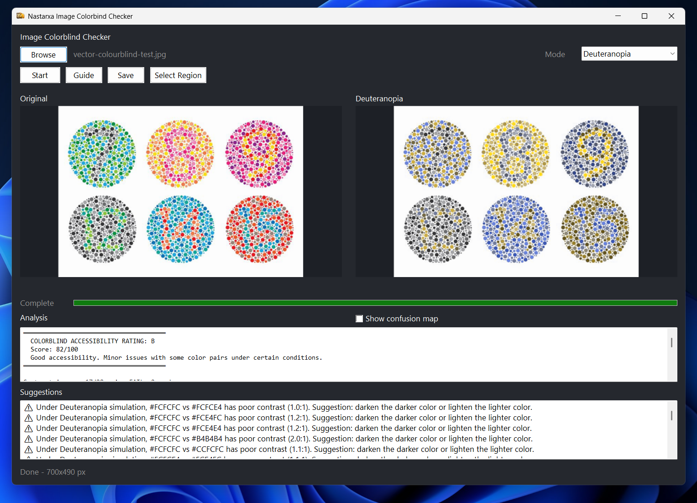

# 🎨 Nastarxa Image Colorblind Checker

A Windows desktop accessibility tool built with AutoHotkey v2 for previewing artwork, illustrations, UI mockups, and graphics through common colorblind simulation modes.

Designed for artists, UI designers, game developers, and accessibility-focused workflows.

---

## 🖼 Image Preview

---

# ✨ Features

## 🖼️ Image Preview & Simulation

Load images using:

* `Browse`
* Drag & drop

Preview multiple accessibility modes:

* Deuteranopia
* Protanopia
* Tritanopia
* All Three
* Grayscale
* Luminance

Includes optional:

* confusion map overlay
* side-by-side comparison workflow

---

# 🎯 Accessibility Analysis

## Dominant Color Detection

Analyze the most dominant colors inside the image and evaluate:

* WCAG-style contrast readability
* weak color separation
* difficult color pair visibility

The tool also provides accessibility suggestions for problematic combinations.

---

# 🔍 Region Analysis

Select a specific region of the image for targeted analysis.

Workflow:

1. Press `Select Region`
2. Click two points on the original image
3. Press `Start`

The selected region becomes the active analysis area.

Useful for checking:

* UI buttons
* icons
* text regions
* character silhouettes
* gameplay readability

---

# 💾 Export Support

Export filtered previews while preserving:

* original image size
* original DPI
* original aspect ratio

Supported formats:

* PNG
* JPG / JPEG
* BMP
* GIF
* TIFF

Unsupported formats such as `WebP` can be exported as PNG.

The application also generates a text accessibility report next to the exported image.

---

# 📚 Built-In Accessibility Guide

Includes an integrated guide featuring:

* colorblind-friendly palettes
* accessibility references
* readable color combinations
* WCAG-inspired suggestions

Useful for:

* UI design
* infographics
* game interfaces
* charts and graphs
* pixel art readability

---

# ⚙️ Requirements

* Windows
* AutoHotkey v2

No external dependencies required.

---

# 🚀 Usage

1. Run `Nastarxa Image Colorblind Checker.ahk`
2. Load or drag an image into the application
3. Select a preview mode
4. Press `Start`
5. Review analysis results
6. Use `Save` to export the filtered preview

> Changing the mode does not automatically reprocess the image.
> Press `Start` after selecting a new mode.

---

# 📌 Notes

Colorblind simulation should be treated as a practical preview tool, not a perfect medical representation.

For better accessibility results, combine color usage with:

* labels
* icons
* shapes
* patterns
* line styles
* contrast hierarchy
* motion or spacing cues

---

# 🧠 Recommended Use Cases

* Game UI accessibility
* Pixel art readability checks
* Anime subtitle readability
* Infographic accessibility
* Data visualization previews
* UI/UX validation
* Illustration readability testing

---

# 📜 License

MIT License

See [`LICENSE`](./LICENSE).

---

# ⚠️ Disclaimer

This project was developed with the assistance of AI tools.
AI was used to support code writing, refactoring, and documentation, while the design direction, features, and final implementation were guided and reviewed by the author.
